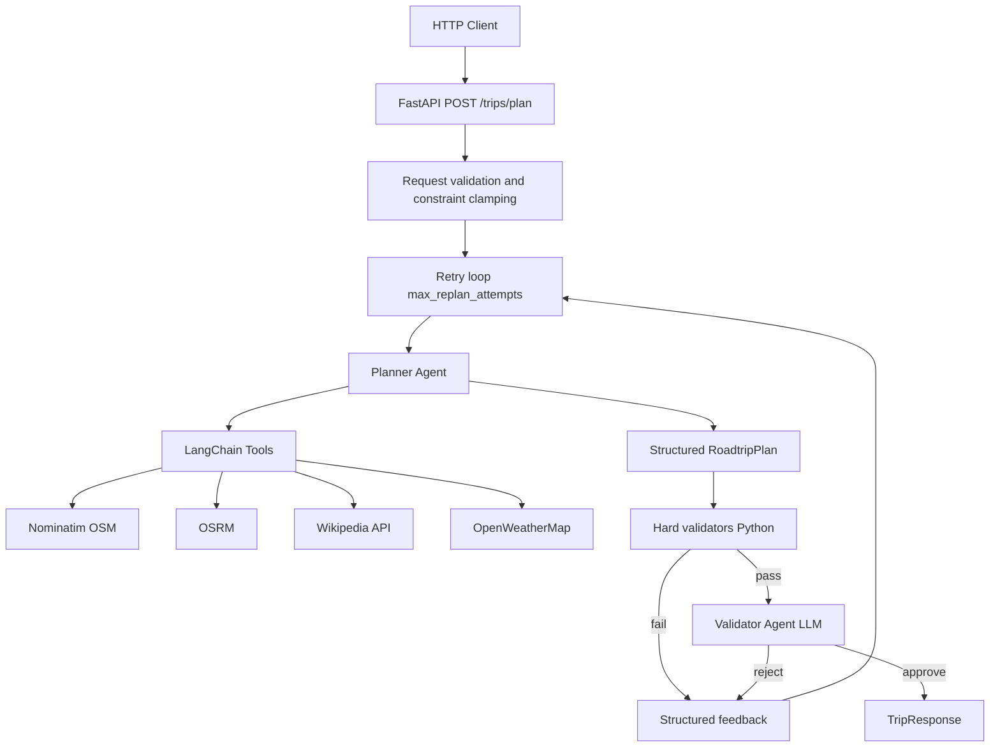

# Roadtrip Planner — Application Plan

This document captures the full design, architecture, and implementation plan for the **Roadtrip Planner** application as discussed and built. It serves as the single source of truth for what the system does, how it is structured, and what is planned for future phases.

---

## 1. Overview

The Roadtrip Planner is an AI-powered itinerary generator that takes a trip request (origin, destination, dates, preferences, and constraints) and returns a structured, day-by-day roadtrip plan with driving segments, stops, overnight stays, and validation results.

**Core goals:**

- Produce **realistic, OSRM-verified** driving itineraries
- Discover **points of interest** via Wikipedia
- Include **weather context** for overnight cities
- Enforce **hard constraints** in Python and **soft preferences** via a Validator agent
- Return **structured JSON** (Pydantic models), not free-form markdown

---

## 2. Technology Stack

| Layer | Choice | Rationale |
|-------|--------|-----------|
| API framework | **FastAPI** | Async support, OpenAPI docs, Pydantic integration |
| LLM | **OpenAI** (`gpt-4o-mini` default) | Tool-calling, structured output, cost-efficient |
| Orchestration | **LangChain** (`create_agent`) | Tool-calling agents with LangSmith tracing |
| Maps / geocoding | **OpenStreetMap (Nominatim)** | Free geocoding with required User-Agent |
| Routing | **OSRM** (public demo server for MVP) | Real driving distances and durations |
| Attractions / POIs | **Wikipedia API** | Search and geosearch for points of interest |
| Weather | **OpenWeatherMap** | Forecast data for overnight cities |
| HTTP client | **httpx** | Async calls to external APIs |
| Validation | **Python hard validators + LLM Validator agent** | Reliable math/routing checks + preference fit |

**Explicitly not used (for this design):** Google Maps, Tavily (present in `.env` but not part of core architecture).

---

## 3. Architecture



### Agent model

Two agents with distinct responsibilities:

| Agent | Role | Tools | Temperature |
|-------|------|-------|-------------|
| **Planner / Router** | Geocode, segment route, find POIs, fetch weather, draft itinerary | Nominatim, OSRM, Wikipedia, OpenWeather | ~0.4 |
| **Validator** | Soft checks: pacing, preferences, weather vs activities | OSRM (re-verification only) | ~0.1 |

**Design decision:** A **Planner + Validator** split is preferred over a single agent because:

- The Planner is creative; the Validator is critical
- Hard routing checks (OSRM) catch hallucinated drive times
- Validation feedback drives targeted replanning

**Weather:** Implemented as a **tool** on the Planner (not a separate Weather agent). A dedicated Weather agent is deferred to a future phase.

### Orchestration

**MVP choice:** FastAPI retry loop (not LangGraph).

```
for attempt in range(max_replan_attempts + 1):
    plan = planner(request, feedback)
    hard_report = run_hard_validators(plan, request)
    if hard_report.hard_failures:
        feedback = hard_report messages → continue
    soft_result = validator(plan, request)
    if soft_result.approved:
        return success
    feedback = soft_result.replan_instructions → continue
return best-effort plan + approved=false
```

---

## 4. Project Structure

```
Roadtrip_Planner/
├── PLAN.md                       # This document
├── requirements.txt
├── .env                          # API keys (not committed)
├── app/
│   ├── main.py                   # FastAPI app + /health
│   ├── config.py                 # pydantic-settings
│   ├── models/
│   │   ├── trip.py               # TripRequest, TripResponse
│   │   ├── constraints.py        # TripConstraints
│   │   ├── itinerary.py          # RoadtripPlan, DayPlan, Stop, OvernightStop
│   │   └── validation.py         # RuleViolation, ValidationReport, ValidationResult
│   ├── services/
│   │   ├── nominatim.py          # Geocoding client (rate-limited)
│   │   └── osrm.py               # Routing client (distance, duration)
│   ├── tools/
│   │   ├── geocode.py
│   │   ├── routing.py
│   │   ├── wikipedia.py
│   │   └── weather.py
│   ├── validators/
│   │   ├── hard.py               # Orchestrates all code-level checks
│   │   ├── driving.py            # DRIVE-001, SCHED-001
│   │   ├── routing.py            # ROUTE-001, ROUTE-002
│   │   ├── structure.py          # STRUCT-001..004
│   │   ├── geography.py          # GEO-001
│   │   └── poi.py                # POI-003
│   ├── agents/
│   │   ├── planner.py            # Planner agent + structured output
│   │   └── validator.py          # Soft validator agent
│   ├── prompts/
│   │   ├── planner.py
│   │   └── validator.py
│   └── routers/
│       └── trips.py              # POST /trips/plan retry loop
```

---

## 5. API Endpoints

| Method | Path | Purpose |
|--------|------|---------|
| `GET` | `/health` | Liveness check |
| `POST` | `/trips/plan` | Generate full itinerary + validation report |

OpenAPI interactive docs: `http://127.0.0.1:8000/docs`

### Example request

```json
POST /trips/plan
{
  "origin": "San Francisco, CA",
  "destination": "Portland, OR",
  "start_date": "2026-07-15",
  "end_date": "2026-07-19",
  "preferences": "scenic coastal routes, breweries",
  "constraints": {
    "max_driving_hours_per_day": 6.0,
    "allow_extended_stays": false,
    "allow_return_stops": false
  }
}
```

### Example response shape

```json
{
  "plan": { "title": "...", "total_days": 5, "days": [...], "tips": [...] },
  "validation": {
    "approved": true,
    "hard_failures": [],
    "warnings": [],
    "replan_attempts": 0
  },
  "replan_attempts": 0
}
```

If replanning is exhausted, the API returns the last draft with `approved: false` and violation details (not a 500 error).

---

## 6. Data Models

### TripRequest

| Field | Type | Notes |
|-------|------|-------|
| `origin` | string | City or landmark name |
| `destination` | string | City or landmark name |
| `start_date` | date | Trip start |
| `end_date` | date | Trip end (must be ≥ start_date) |
| `preferences` | string \| null | Free-text user preferences |
| `constraints` | TripConstraints | Defaults applied if omitted |

`days` is derived server-side: `(end_date - start_date).days + 1`

### TripConstraints (minimal MVP schema)

| Field | Default | Notes |
|-------|---------|-------|
| `max_driving_hours_per_day` | 6.0 | API-configurable, **hard cap 8.0** |
| `max_stops_per_day` | 4 | SCHED-001 |
| `max_detour_km_per_stop` | 30.0 | ROUTE-001 |
| `max_backtracking_percent` | 15.0 | ROUTE-002; raised to 25 when return trip |
| `require_progress_toward_destination` | true | Disabled when `allow_return_stops=true` |
| `allowed_countries` | `["US", "MX"]` | Canada excluded by default |
| `excluded_poi_categories` | `["extremely_dangerous", "illegal"]` | Always merged server-side; non-removable |
| `allow_extended_stays` | false | Multi-night camping/hotel/resort stays |
| `max_nights_per_stop` | 1 | Up to 7 when extended stays enabled |
| `allow_return_stops` | false | Revisit same city on return leg |
| `max_replan_attempts` | 2 | Drives FastAPI retry loop |

### RoadtripPlan

| Field | Description |
|-------|-------------|
| `title` | Trip title |
| `total_days` | Number of days |
| `origin_lat`, `origin_lon` | Geocoded origin |
| `destination_lat`, `destination_lon` | Geocoded destination |
| `days` | List of `DayPlan` |
| `tips` | Packing / travel tips |

### DayPlan

| Field | Description |
|-------|-------------|
| `day`, `date` | Day number and calendar date |
| `route_summary` | Human-readable route description |
| `driving_hours` | Planned driving time |
| `stops` | Mid-day POIs (`Stop`) |
| `overnight` | `OvernightStop` |
| `leg_start_lat/lon`, `leg_end_lat/lon` | Driving segment endpoints for OSRM validation |

### OvernightStop

| Field | Description |
|-------|-------------|
| `city`, `lat`, `lon` | Location |
| `stay_type` | `camping`, `hotel`, `resort`, `other` |
| `nights` | Nights at this stop (default 1) |
| `is_return_stop` | True if revisiting on return leg |
| `country_code` | ISO country code from Nominatim |

### ValidationReport / RuleViolation

Each violation includes: `rule_id`, `severity` (`error` \| `warning` \| `info`), optional `day`, `message`, `actual`, `limit`.

---

## 7. External API Integrations

### Nominatim (OpenStreetMap)

- **Endpoint:** `GET /search?q={place}&format=json&limit=1`
- **Required:** Descriptive `User-Agent` header
- **Rate limit:** 1 request/second
- **Returns:** `display_name`, `lat`, `lon`, `address.country_code`
- **Caching:** In-memory per request to avoid duplicate geocode calls

### OSRM

- **Endpoint:** `GET /route/v1/driving/{lon1},{lat1};{lon2},{lat2}`
- **Public demo:** `https://router.project-osrm.org` (dev/MVP only; self-host for production)
- **Coordinates:** Internal `(lat, lon)`; URL uses `lon,lat` order
- **Returns:** Distance (km), duration (hours)

### Wikipedia

- **Text search:** `action=query&list=search&srsearch={topic} {location}`
- **Geo search:** Available when lat/lon known
- **Returns:** Top 3–5 article titles + snippets

### OpenWeatherMap

- **Endpoint:** `GET /data/2.5/forecast?q={city}&units=metric`
- **Requires:** `OPENWEATHER_API_KEY` in `.env`
- **Returns:** 3-hour interval forecasts for packing hints and soft validation

---

## 8. LangChain Tools

### Planner tools

| Tool | Purpose |
|------|---------|
| `geocode_location` | City/landmark → coordinates + country |
| `get_driving_route` | Segment distance (km) + duration (hours) |
| `search_wikipedia_attractions` | POI discovery |
| `get_weather_forecast` | Forecast for overnight cities |

### Validator tools

| Tool | Purpose |
|------|---------|
| `get_driving_route` | Independent OSRM re-verification of planner claims |

### Planner output pipeline

1. **Research phase:** LangChain `create_agent` runs tools and gathers real data
2. **Structured phase:** `llm.with_structured_output(RoadtripPlan)` converts research into validated Pydantic JSON

---

## 9. Validation Rules

Validation is split into three layers:

| Layer | Enforced by | Examples |
|-------|-------------|----------|
| **Hard rules** | Python + OSRM | Max driving hours, detour limits, schema |
| **Configurable rules** | API request (with caps) | Max hours/day, stops/day, scenic preference |
| **Soft rules** | Validator agent | Pacing, preference fit, weather vs activities |

### Hard validation pipeline (order)

1. STRUCT — overnight / day structure
2. GEO-001 — country allowlist
3. POI-003 — excluded categories
4. DRIVE-001 — daily driving cap (OSRM-verified)
5. ROUTE-001 — per-stop detour
6. ROUTE-002 — backtracking percent

---

### DRIVE-001 — Daily driving cap

- Sum OSRM `duration_hours` for each day's driving segments
- Fail if any day exceeds `max_driving_hours_per_day`
- Also compare planner-stated `driving_hours` against OSRM (±0.5h tolerance)

### SCHED-001 — Max stops per day

- Fail if `len(day.stops) > max_stops_per_day`

### ROUTE-001 — Stop detour

For each mid-day stop `S` on leg `O → D`:

```
detour_km = OSRM(O, S) + OSRM(S, D) - OSRM(O, D)
fail if detour_km > max_detour_km_per_stop
```

Skip for extended-stay rest days with no driving.

### ROUTE-002 — Backtracking

```
D_total = OSRM(trip_origin, trip_destination)
progress[d] = OSRM(trip_origin, overnight_end[d])
backtrack_km = sum(max(0, progress[d-1] - progress[d]))
backtracking_percent = (backtrack_km / D_total) * 100
fail if backtracking_percent > max_backtracking_percent
```

When `allow_return_stops=true`:

- Monotonic progress check is disabled
- Backtracking cap is raised to at least 25%

### STRUCT rules — Trip structure & overnight stays

| Rule | Description |
|------|-------------|
| **STRUCT-001** | Day count and dates match request (`start_date` … `end_date`) |
| **STRUCT-002** | Consecutive stay length ≤ `max_nights_per_stop` (when extended stays allowed) |
| **STRUCT-003** | Non-consecutive duplicate city only if `allow_return_stops=true` and `is_return_stop=true` |
| **STRUCT-004** | Default single-night stay; consecutive multi-night requires `allow_extended_stays=true` |

**Overnight stay policy:**

| Case | Default | How to allow |
|------|---------|--------------|
| One night per city | Yes | Default behavior |
| Consecutive multi-night (camp/hotel/resort) | No | `allow_extended_stays=true` + `max_nights_per_stop` |
| Same city again later (return leg) | No | `allow_return_stops=true` + `is_return_stop=true` |

**Implementation note:** Consecutive nights are grouped into **sequences** per city; each sequence is validated **once** (not once per consecutive pair), avoiding duplicate violations and unnecessary replans.

### GEO-001 — Country allowlist

- Default allowed: **US**, **MX** (Canada excluded)
- Every overnight stop and POI `country_code` must be in `allowed_countries`

### POI-003 — Excluded categories

- System defaults (always enforced): `extremely_dangerous`, `illegal`
- Merged with any client-provided `excluded_poi_categories`
- Fail if any stop `category` matches

---

## 10. Validator Agent (soft rules)

The Validator agent reviews plans that pass hard validation and checks:

- **Pacing:** Is a day too rushed given stops + driving?
- **Preferences:** Were user preferences respected (scenic routes, food, family-friendly)?
- **Weather fit:** Do outdoor activities conflict with forecast conditions?
- **Coherence:** Does the narrative match structured data?

**Output:** `ValidationResult { approved, issues, replan_instructions, severity }`

The Validator **cannot** approve a plan that has hard failures — that gate is enforced in the FastAPI loop, not left to the LLM.

---

## 11. Configuration

### Environment variables (`.env`)

```env
OPENAI_API_KEY=sk-...
OPENWEATHER_API_KEY=...          # Required for live weather forecasts
NOMINATIM_USER_AGENT=RoadtripPlanner/1.0 (you@example.com)

# Optional — LangSmith tracing (already configured)
LANGSMITH_API_KEY=...
LANGSMITH_TRACING=true
LANGSMITH_PROJECT=Roadtrip_Planner
```

### Settings (`app/config.py`)

| Setting | Default |
|---------|---------|
| `openai_model` | `gpt-4o-mini` |
| `osrm_base_url` | `https://router.project-osrm.org` |
| `nominatim_base_url` | `https://nominatim.openstreetmap.org` |
| `wikipedia_api_url` | `https://en.wikipedia.org/w/api.php` |
| `openweather_base_url` | `https://api.openweathermap.org/data/2.5` |

---

## 12. Running the Application

```powershell
cd Roadtrip_Planner
python -m pip install -r requirements.txt
python -m uvicorn app.main:app --reload
```

- Health: http://127.0.0.1:8000/health
- API docs: http://127.0.0.1:8000/docs

---

## 13. MVP Scope (implemented)

- [x] FastAPI with `GET /health` and `POST /trips/plan`
- [x] Planner agent (LangChain `create_agent` + structured output)
- [x] Validator agent (soft checks + OSRM re-verification)
- [x] Tools: Nominatim, OSRM, Wikipedia, OpenWeatherMap
- [x] Hard validators: DRIVE-001, ROUTE-001/002, STRUCT-001–004, GEO-001, POI-003
- [x] `TripConstraints` with API-configurable rules (8h driving cap)
- [x] FastAPI retry loop for replanning
- [x] Default countries: US, MX; excluded POIs: dangerous/illegal
- [x] Multi-night stays and return stops (constraint-gated)

---

## 14. Future Phases (out of scope for MVP)

| Phase | Feature |
|-------|---------|
| Orchestration | LangGraph state machine (`plan → validate → replan` nodes) |
| Documentation | README, `.env.example` |
| Testing | Unit tests for validators and OSRM helpers |
| Infrastructure | Redis caching, streaming responses, frontend UI |
| Routing | Self-hosted OSRM, toll/highway/scenic profiles |
| Agents | Dedicated Weather sub-agent |
| Preferences | Structured pace (`relaxed` / `moderate` / `packed`), budget, accessibility |
| Validation | `fail_on_weather_warnings`, precipitation/temperature thresholds |

---

## 15. Operational Notes

- **Nominatim:** Respect 1 req/sec; use in-memory geocode cache per request
- **OSRM demo server:** Not for production traffic; self-host for scale
- **Partial failure:** Return last draft + violations when replan loop exhausts attempts
- **422 errors:** Invalid cross-field constraints rejected before agents run
- **LangSmith:** Existing `.env` tracing vars provide agent observability without extra code

---

## 16. Design Principles

1. **Planner never self-approves** — validation is always separate
2. **Hard checks in code first** — cheaper and more reliable than LLM for math/routing
3. **Validator re-runs OSRM** — do not trust planner-stated distances blindly
4. **Structured feedback** — validator returns `replan_instructions`, not vague prose
5. **Cap retries** — `max_replan_attempts` prevents infinite loops
6. **Shared schema** — Planner and Validator use the same `RoadtripPlan` Pydantic model
7. **One violation per stay sequence** — consecutive-night checks group days into sequences to avoid duplicate failures

---

*Last updated: July 2026*
